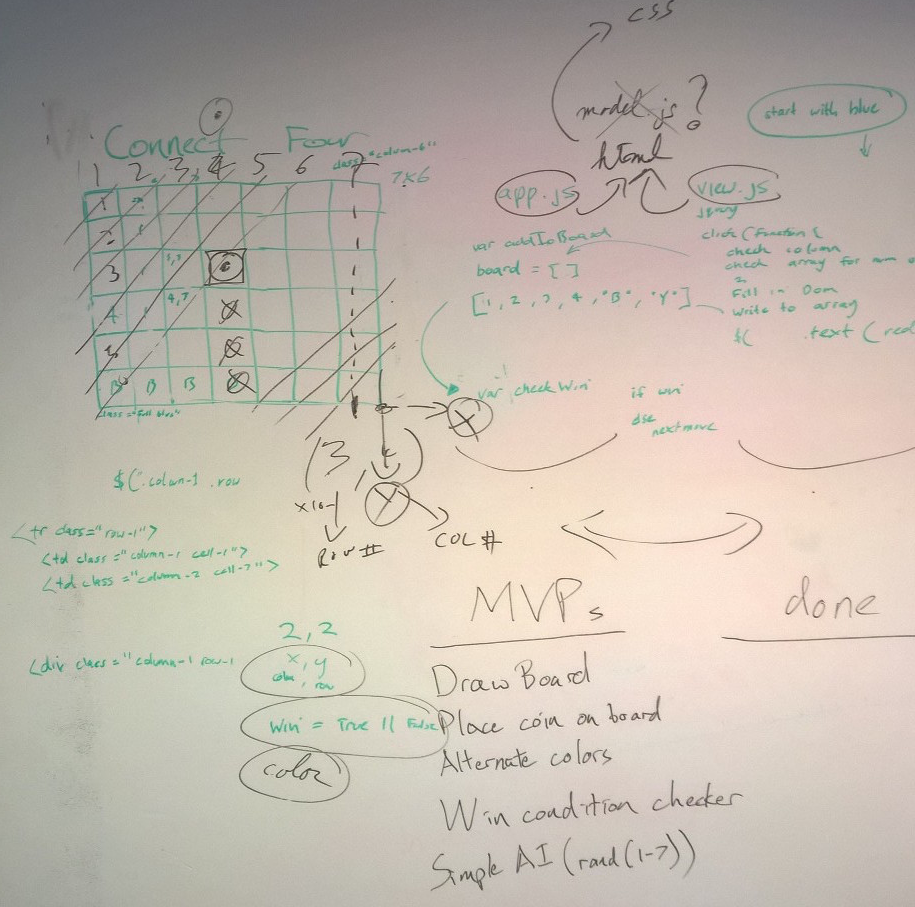
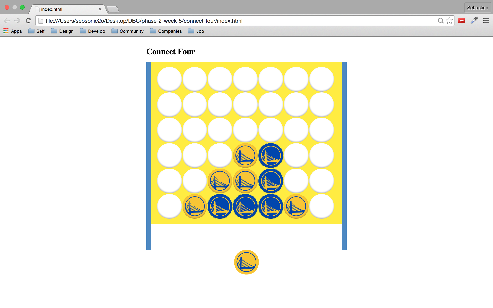
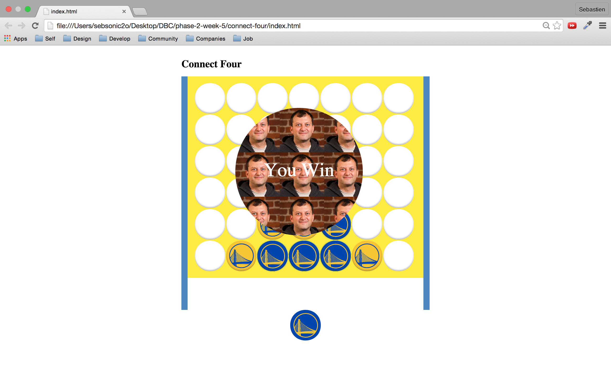

# Connect Four

Connect Four is a single-page application to play the connection game with a friend.

It was written in JavaScript, leveraging Animate.css and jQuery UI.

As part of a fun one-day group project, we first went into some creative whiteboarding...

We then self-organized into two teams. One team was responsible for the user experience, and another team was in charge of the game logic. The key to our success was to clearly define expected inputs and outputs.

## Play

Turn-based, a player drops a coin, dragging it to the board or clicking on a column.

## Win

The winner is the first player to connect four horizontally, vertically, or diagonally.

